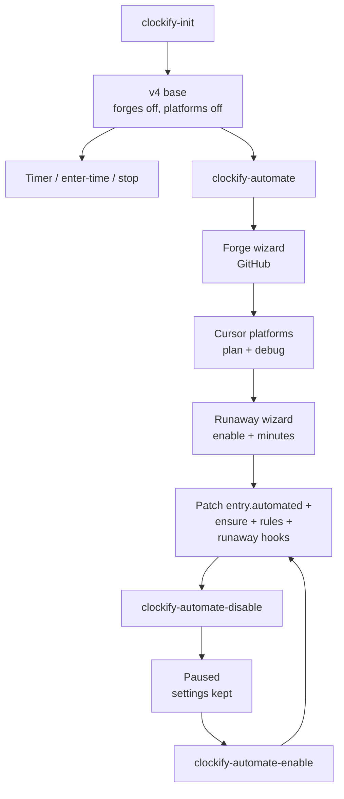
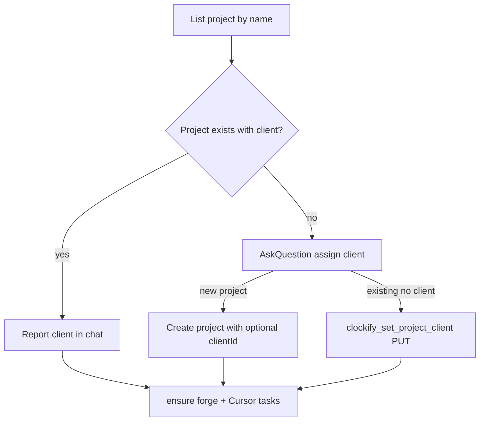
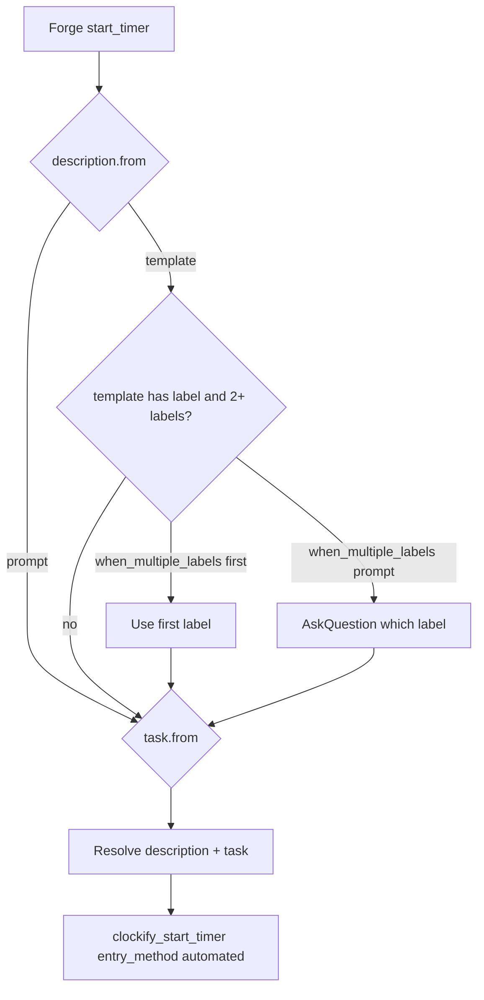

<br><br>

<h1>Flows</h1>
<br clear="both">

Decision maps for skills. Agent procedures stay in each `SKILL.md`; field lists stay in [schema/config.yml.md](./schema/config.yml.md). If a section outgrows this file, split into `docs/flows/` later.

<br>

## Contents

- [Contents](#contents)
- [Product ladder](#product-ladder)
- [clockify-init](#clockify-init)
  - [Why workspace is required](#why-workspace-is-required)
  - [AskQuestion: workspace](#askquestion-workspace)
  - [Data in / out](#data-in--out-init)
- [clockify-automate](#clockify-automate)
  - [Forge wizard](#forge-wizard)
  - [Cursor platforms wizard](#cursor-platforms-wizard)
  - [Runaway wizard](#runaway-wizard)
  - [Project client (Clockify only)](#project-client-clockify-only)
  - [AskQuestion: assign client](#askquestion-assign-client)
  - [on_start resolution](#on_start-resolution)
  - [Data in / out](#data-in--out-automate)
- [clockify-automate-disable / enable](#clockify-automate-disable--enable)

---

<br>

## Product ladder



| Stage | Skill | User gets |
|-------|-------|-----------|
| Base | `/clockify-init` | Workspace pin, prompt descriptions, timer task none, `entry.automated.enabled: false`, all forges off, empty triggers, Cursor platforms off |
| Automated | `/clockify-automate` | Forge wizard (GitHub), Cursor Plan/Debug, runaway enable + minutes, ensure project/tasks, Cursor rules, runaway hooks when enabled |
| Pause | `/clockify-automate-disable` / `enable` | Temporary off/on; keep forge / triggers / modes; remove/restore Cursor glue |

---

<br>

## clockify-init

`/clockify-init` pins **where** time goes (`scope.workspace_id`) and writes the v4 base contract. It does **not** ensure projects/tasks or enable automation. Skill steps: [clockify-init](../skills/clockify-init/SKILL.md).

### Why workspace is required

Clockify’s “active” workspace follows whatever the user last opened in the product UI. A background agent plus someone clicking around Clockify would then `ensure_project` and write entries in the wrong workspace. Init always writes `scope.workspace_id`. MCP tools never fall back to active/default workspace.

### AskQuestion: workspace

- Purpose: pin `scope.workspace_id`.
- Options: listed workspaces only (`clockify_list_workspaces`). **No** option 0 / “use active”.
- Cursor Other is not used for create-workspace (out of scope).

```text
Choose the Clockify workspace for this repo:
1 - Workspace A Name (abc123...)
2 - Workspace B Name (def456...)
```

Then write `.clockify/config.yml` from the plugin example (`plugin` / `scope` / `entry`), set `workspace_id`, leave `entry.automated` off (all forges `enabled: false`, empty triggers, Cursor platforms off). Write ignore markers. End: timer and enter-time are ready; run `/clockify-automate` for forge + Cursor automation.

### Data in / out (init)

| Direction | What |
|-----------|------|
| In | `clockify_list_workspaces`, git toplevel / folder name for `local_folder` |
| Out (yaml) | `plugin.version: 4`, `scope.workspace_id`, `scope.project.from: local_folder`, `entry.timer` / `manual` / `automated` base scaffold |
| Out (Clockify) | None — no project/task ensure |

---

<br>

## clockify-automate

Mode on. If config is missing, run init first. Then forge + Cursor + runaway wizards, patch yaml, ensure resources, write Cursor rules, and install Clockify-owned runaway hooks when enabled. Skill: [clockify-automate](../skills/clockify-automate/SKILL.md).

### Forge wizard

Skip when one forge under `entry.automated.forge` is already enabled, unless the user asks to reconfigure. After `/clockify-unautomate`, all forges are off — always ask. After `/clockify-automate-disable`, the forge stays enabled — skip (resume like enable) unless they ask to reconfigure.

1. **Forge** — AskQuestion. Only **GitHub** is implemented. Set `entry.automated.forge.github.enabled: true` (gitlab/bitbucket remain `false`; at most one may be true).
2. **Project** — how `scope.project` resolves: `local_folder`, `fixed` (+ name), or `prompt` (ask each time; skip ensure).
3. **on_start description** — `prompt` or `template` under `settings.on_start` (preset `{issue_number} - {issue_title}` or custom).
4. **on_start task** — `template` / `local_folder` / `fixed` / `none` / `prompt` under `settings.on_start.task`.
5. **when_multiple_labels** — only if a chosen template contains `{label}`: `first` or `prompt`. Default if skipped: `first`.
6. **Client when ensuring** — see below (not stored in yaml).

Then set root forge `triggers`:

```yaml
triggers:
  - event: issue_start
    action: start_timer
  - event: issue_finish
    action: stop_timer
  - event: issue_switch
    action: stop_then_start
  - event: pr_ship
    action: stop_timer
  - event: pr_closed
    action: stop_timer
```

### Cursor platforms wizard

Skip when `platforms.cursor.modes` already has mode blocks (even if `platforms.cursor.enabled` is false after a pause), unless the user asks to reconfigure. After `/clockify-unautomate`, `modes` is `{}` — always ask.

Ask whether to enable Cursor Plan and Debug mode timers (defaults: **yes** for both). Optionally rename fixed task names (defaults: `agent_planning`, `agent_debug`).

Write under `entry.automated.platforms.cursor`:

- `enabled: true` when either mode is on
- Per enabled mode, use the **array** trigger shape (not a `start:` / `stop:` map):

```yaml
plan:
  enabled: true
  triggers:
    - event: start
      action: start_timer
    - event: stop
      action: stop_timer
  description:
    from: prompt
  task:
    from: fixed
    name: agent_planning
    if_missing: create
```

Same for `debug` with `name: agent_debug` (or renamed).

If both declined: `platforms.cursor.enabled: false`, `modes: {}`.

Plan/Debug detection is **rule-first** (`.cursor/rules/clockify.mdc`). Mode hooks are not supported ([#85](https://github.com/dustinestes/clockify-agent-plugin/issues/85) wontfix).

### Runaway wizard

Skip when one forge under `entry.automated.forge` is already enabled unless the user asks to reconfigure runaway. After `/clockify-unautomate`, always ask. After `/clockify-automate-disable`, keep existing `settings.runaway` values unless they ask to reconfigure.

1. **Enable?** AskQuestion (default **yes**): warn when a running timer exceeds a runaway ceiling?
2. **Minutes** — only if yes: AskQuestion with presets (suggested default **45**) or a custom positive int.

Patch `entry.automated.settings.runaway`. When `enabled` is true, automate **must** install `.cursor/hooks/clockify-runaway.sh`, register it under `sessionStart` / `sessionEnd` / `stop` in `.cursor/hooks.json` (fail-open; instruct AskQuestion when `pastCeiling`), and add the script path to the managed `.gitignore` stanza (do **not** ignore `hooks.json`). When false, remove those Clockify-owned entries, the script, and its gitignore line. `/clockify-unautomate` removes them surgically by script path.

### Project client (Clockify only)

Clients live on the Clockify **project**, not in `config.yml`. After the project name is known (`local_folder` folder name, or `scope.project.name` for fixed; skip when `from` is `prompt`):

- **Project found with client:** skip AskQuestion; report `Client: <name> (already set on project)`. Do not change it.
- **Project missing or no client:** AskQuestion assign client (below), then ensure / set client.



### AskQuestion: assign client

- **Prerequisite:** `clockify_list_clients` in the pinned workspace — build options from the response; do not open AskQuestion until this returns (or fails).
- Purpose: optionally assign a client on a **new** project or an existing project that has none.
- No `N -` prefixes (AskQuestion letters options A, B, C…).
- Authored options: `None`, then **each** unarchived client name from `list_clients`, then `Create Client`. Empty list or list error: **only** `None` and `Create Client`.
- **Create Client** → ask the name in **chat** (not AskQuestion); then `clockify_create_client`.
- List error: still use `None` + `Create Client`; chat `Client: failed to retrieve clients`.
- Never PATCH a project that already has a client. Never write client into `config.yml`.

### on_start resolution

Forge starts honor `entry.automated.settings.on_start`. Expand templates with `{issue_number}`, `{issue_title}`, `{label}`, `{local_folder}`.



When `cursor_mode` is set, the matching `platforms.cursor.modes.<mode>` block overrides this forge `settings.on_start` path.

### Data in / out (automate)

| Direction | What |
|-----------|------|
| In | Existing config (or init first), `clockify_list_projects`, `clockify_list_clients`, optional `gh label list`, folder name |
| Out (yaml) | `entry.automated.enabled: true`, `forge` map, `settings` (on_start / rounding / overlap / runaway), root forge `triggers`, `platforms.cursor`; may patch `scope.project` |
| Out (Clockify) | `ensure_project` / `set_project_client` / `create_client` as needed; `ensure_task` for `{label}` labels, `local_folder`/`fixed` on_start tasks, Cursor fixed task names |
| Out (Cursor) | `.cursor/rules/clockify.mdc` from declared triggers + platforms; when runaway enabled, `.cursor/hooks/clockify-runaway.sh` + `hooks.json` entries |

---

<br>

## clockify-automate-disable / enable

Temporary pause without wiping automate-owned settings. Skills: [clockify-automate-disable](../skills/clockify-automate-disable/SKILL.md), [clockify-automate-enable](../skills/clockify-automate-enable/SKILL.md). Full rollback remains [clockify-unautomate](../skills/clockify-unautomate/SKILL.md).

| Want | Skill |
|------|-------|
| Temporary pause, keep settings | `/clockify-automate-disable` → `/clockify-automate-enable` |
| Full rollback of automate settings | `/clockify-unautomate` |
| Remove all local Clockify files | `/clockify-uninit` |

**Disable:** confirm → remove Cursor rule + Clockify-owned runaway hooks → set `entry.automated.enabled: false` and `platforms.cursor.enabled: false` → keep one forge enabled / `settings.on_start` / triggers / `settings.runaway` prefs / `modes`.

**Enable:** confirm → set `enabled: true`, restore `platforms.cursor.enabled` when modes warrant it → rewrite rule from preserved config → reinstall runaway hooks only if `settings.runaway.enabled` is still true. Skip wizards unless all forges are off (then redirect to `/clockify-automate`).

Re-running `/clockify-automate` while paused also skips wizards when a forge is already enabled (same resume path) unless the user asks to reconfigure.

---

<br>

---

<strong>Clockify Agent Plugin</strong>
<div align="right">

[MIT License](../LICENSE)

</div>
<br clear="both">
