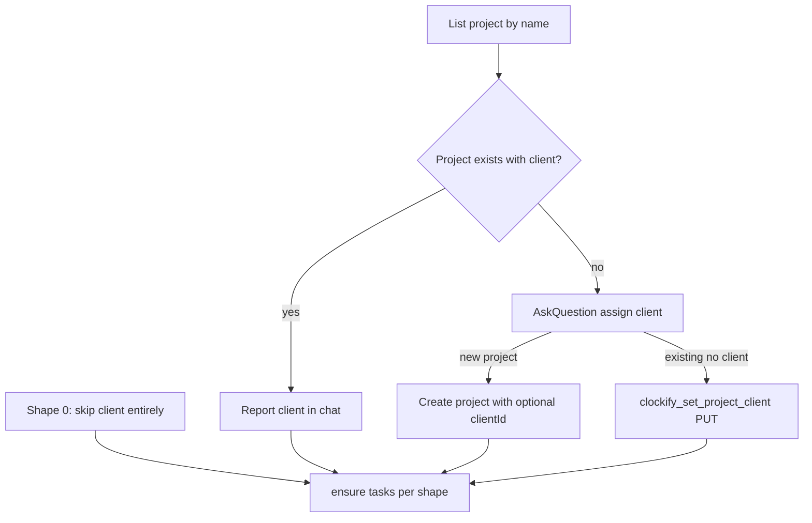

  

<h1>Flows</h1>
 

Decision maps for skills. Agent procedures stay in each `SKILL.md`; field lists stay in [schema/config.yml.md](./schema/config.yml.md). If a section outgrows this file, split into `docs/flows/` later.

 

## Contents

- [Contents](#contents)
- [clockify-init](#clockify-init)
  - [Why workspace is required](#why-workspace-is-required)
  - [AskQuestion: workspace](#askquestion-workspace)
  - [AskQuestion: shape](#askquestion-shape)
  - [AskQuestion: project name (shape 2)](#askquestion-project-name-shape-2)
  - [Project client (Clockify only)](#project-client-clockify-only)
  - [AskQuestion: assign client](#askquestion-assign-client)
  - [Data in / out](#data-in--out)

---

 

## clockify-init

`/clockify-init` pins **where** time goes (`scope`) before it writes method blocks. Skill steps: [clockify-init](../skills/clockify-init/SKILL.md).

### Why workspace is required

Clockify’s “active” workspace follows whatever the user last opened in the product UI. A background agent plus someone clicking around Clockify would then `ensure_project` and write entries in the wrong workspace. Init always writes `scope.workspace_id`. MCP tools never fall back to active/default workspace.

### AskQuestion: workspace

- Purpose: pin `scope.workspace_id`.
- Options: listed workspaces only (`clockify_list_workspaces`). **No** option 0 / “use active”.
- Cursor Other is not used for create-workspace (out of scope).

### AskQuestion: shape

- Purpose: choose taxonomy 0 / 1 / 2 before any Clockify create.
- Options: `0 - None`, `1 - Repo as project`, `2 - Repo as task`.

### AskQuestion: project name (shape 2)

- Purpose: `scope.project.name` when `from: fixed`.
- Options: existing project names in the pinned workspace (plus a labeled folder guess if useful). Do not add a custom Other.

### Project client (Clockify only)

- Shape 0: skip entirely.
- Clients live on the Clockify **project**, not in `config.yml`. Time entries target projects/tasks; Clockify reports group by client.
- **Skip AskQuestion** when the project already has a `clientId` — report the name in chat. Init does **not** change it.
- **Ask** only when the project is missing or exists **without** a client.

### AskQuestion: assign client

- **Prerequisite:** `clockify_list_clients` in the pinned workspace — build options from the response; do not open AskQuestion until this returns (or fails).
- Purpose: optionally assign a client on a **new** project or an existing project that has none.
- No `N -` prefixes (AskQuestion letters options A, B, C…). Follow-up: drop numeric prefixes on workspace/shape prompts too.
- Authored options: `None`, then **each** unarchived client name from `list_clients`, then `Create Client`. Empty list or list error: **only** `None` and `Create Client`.
- **Create Client** → ask the name in **chat** (not AskQuestion); then `clockify_create_client`. Do not offer existing clients or project name as choices **for the new name** — they still belong in the main picker.
- List error: still use `None` + `Create Client`; chat `Client: failed to retrieve clients`.
- Never PATCH a project that already has a client.

### Data in / out

| Direction | What |
|-----------|------|
| In | `clockify_list_workspaces`, `clockify_list_projects`, `clockify_list_clients` (active only), git toplevel folder name, optional GitHub labels (shape 1) |
| Out (yaml `scope`) | `workspace_id` (required), `project` (`from` + optional `name`) |
| Out (Clockify) | `clockify_create_client` on Create Client; `clockify_ensure_project` with `client_id` on **new** project create; `clockify_set_project_client` on existing project without client; `clockify_ensure_task` per shape |

---

 

---

<strong>Clockify Agent Plugin</strong>

[MIT License](../LICENSE)

 
