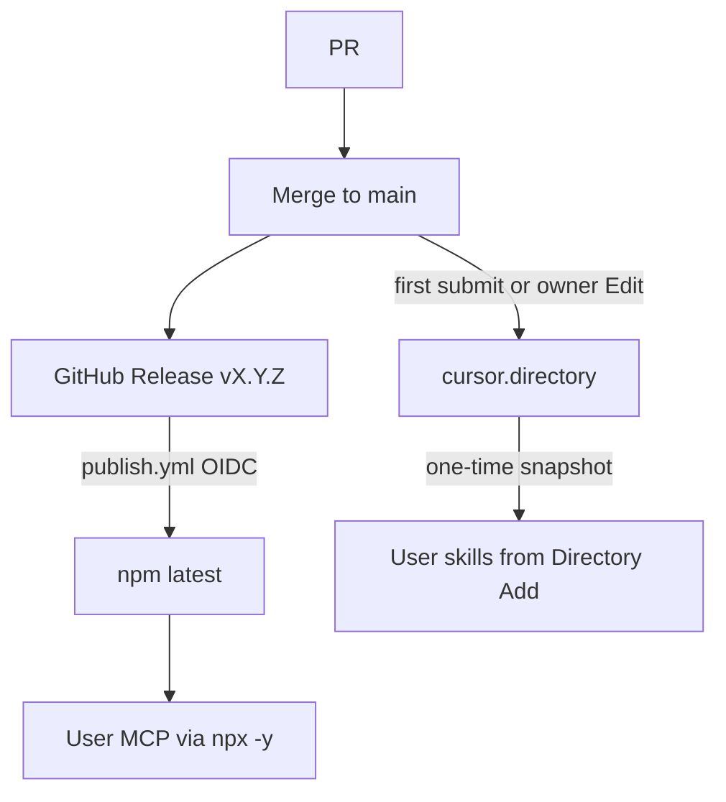

<br><br>

<h1>Publish</h1>
<br clear="both">

Information related to publishing the MCP server (npm) and the Clockify Agent Plugin (agent platforms).

Maintainer skill: [`.cursor/skills/publish-release`](../.cursor/skills/publish-release/SKILL.md) (not a Directory skill).

<br>

## Contents

- [Contents](#contents)
- [Prerequisites](#prerequisites)
- [How a change ships](#how-a-change-ships)
- [GitHub](#github)
  - [Topics](#topics)
  - [CI](#ci)
  - [Release](#release)
- [npm](#npm)
  - [Trusted publishing](#trusted-publishing)
- [Agent platforms](#agent-platforms)
  - [Discovery files](#discovery-files)
  - [Cursor Directory](#cursor-directory)

---

<br>

## Prerequisites

Also meet [Getting started](../README.md#getting-started) and [develop prerequisites](./develop.md#prerequisites). You ship from a working checkout. Skip this section if you already publish this package.

| Name | Description | Command |
|------|-------------|---------|
| GitHub CLI | Authenticated `gh` against this repo (releases, PRs) | `gh auth login` |
| Release access | Merge to `main` and create a published GitHub Release (`vX.Y.Z`) | `gh release create vX.Y.Z --generate-notes` (after merge; see [Release](#release)) |
| npm Trusted Publisher | One-time OIDC so `publish.yml` can `npm publish` (no `NPM_TOKEN`) | Configure on npmjs.com — [Trusted publishing](#trusted-publishing) |
| cursor.directory owner | First listing submit; later catalog changes are **Edit**, never a second submit | [Cursor Directory](#cursor-directory) |

---

<br>

## How a change ships

Two channels. MCP tools ride **unpinned npx** after a GitHub Release. Skills and listing copy are a **Directory snapshot** of GitHub `HEAD` — merge does not refresh the catalog; there is no publisher API.



| Change | What to ship |
|--------|----------------|
| MCP tools (`src/`) | GitHub Release → npm. Skip Directory unless the *command shape* changes (package name, env vars). |
| New/removed skills, skill titles, mcp command shape, logo, listing copy | Merge to `main`, then **Edit** the existing Directory listing so it re-parses `HEAD`. |
| First listing | Website form after npm `latest` matches `main`. Owner-only; the agent cannot submit. |

People who already clicked Add still have the old skill snapshot until they Add again (or clone). MCP tools update on the next `npx` start after npm publish.

---

<br>

## GitHub

Public repo: [dustinestes/clockify-agent-plugin](https://github.com/dustinestes/clockify-agent-plugin). Tags are `v` plus the shared version (`v0.1.0`). GitHub redirects the old `clockify-mcp-server` URL.

Leave `mcp.json` and `.mcp.json` as unpinned npx. Do not point them at `dist/`.

### Topics

`mcp` `model-context-protocol` `clockify` `cursor-plugin` `agent-skills` `agent-plugin` `time-tracking`

### CI

Pull requests and pushes to `main` run `npm ci`, `npm run build`, `npm run test:config`, `npm run check:versions`, and `npm run smoke:handshake` with no Clockify credentials. Handshake only checks MCP `initialize` against `dist/`. That workflow does not publish.

### Release

One shared version: `package.json`, `plugin.json`, and `.cursor-plugin/plugin.json` (and the lockfile). `npm run check:versions` fails closed if they drift; on the publish job it also requires the GitHub Release tag to match.

`@dustinestes/clockify-mcp-server@0.1.0` is leftover on npm under the old name. Do **not** npx that. First CI publish of **`@dustinestes/clockify-agent-plugin`** can be `0.1.0` (this tree) via GitHub Release `v0.1.0`.

1. Confirm `mcp.json` and `.mcp.json` are still the unpinned npx shape.
2. Bump the three manifests (and lockfile) together. Merge to `main`.
3. `gh release create vX.Y.Z --generate-notes` (not a draft, not a prerelease).
4. [`.github/workflows/publish.yml`](../.github/workflows/publish.yml) runs on `release: published` and publishes npm (next section).
5. Confirm `npx -y @dustinestes/clockify-agent-plugin` starts over stdio.

Do not auto-bump on merge. Do not publish from tag-push alone (a tag without a published Release does nothing).

---

<br>

## npm

Package: [`@dustinestes/clockify-agent-plugin`](https://www.npmjs.com/package/@dustinestes/clockify-agent-plugin). This is what Directory users actually run.

Keep `.mcp.json` and `mcp.json` **unpinned** (`npx -y @dustinestes/clockify-agent-plugin`, no `@1.2.3`) so each Cursor start resolves latest npm. Do not rewrite them to a local `dist/` path. Play against a checkout build with `clockify-cursor-install --sandbox` ([develop.md](./develop.md#sandbox)).

```json
{
  "mcpServers": {
    "clockify-agent-plugin": {
      "command": "npx",
      "args": ["-y", "@dustinestes/clockify-agent-plugin"],
      "env": {
        "CLOCKIFY_API_KEY": "${CLOCKIFY_API_KEY}"
      }
    }
  }
}
```

On `release: published`, `publish.yml` runs build, config tests, handshake, version check, then `npm publish --access public` via OIDC. Verify `npm view @dustinestes/clockify-agent-plugin version`. Do not publish on every push to `main`.

<br>


### Trusted publishing

npm authenticates with GitHub Actions OIDC (no `NPM_TOKEN` secret). One-time on [npmjs.com](https://www.npmjs.com/package/@dustinestes/clockify-agent-plugin) → package **Settings** → **Trusted Publisher**:

| Field | Value |
|-------|--------|
| Provider | GitHub Actions |
| Organization or user | `dustinestes` |
| Repository | `clockify-agent-plugin` |
| Workflow filename | `publish.yml` (filename only) |
| Environment | leave empty |
| Allowed actions | `npm publish` |

Configure this **before** the first GitHub Release, on the **new** package name (not the leftover `@dustinestes/clockify-mcp-server`). Provenance is generated automatically for public packages from this workflow.

After the first CI publish succeeds, optionally restrict token publishing on the package (**Require two-factor authentication and disallow tokens**). Manual `npm publish` from a laptop then stops working; that is intended.

---

<br>

## Agent platforms

Cursor Directory is the public listing today. Other galleries may scan the same GitHub tree later; keep discovery files in publish shape on `main`.

### Discovery files

Platforms scan **paths**, not the README.

| File | Role |
|------|------|
| `.mcp.json` | Directory MCP discovery (unpinned `npx`) |
| `skills/*/SKILL.md` | Directory skill snapshot |
| `.cursor-plugin/plugin.json` | Cursor plugin manifest (local install + variables) |
| `plugin.json` | [Agent Plugins](https://agent-plugins.org) portable manifest |
| `mcp.json` | MCP entry for the Cursor plugin (same unpinned npx shape) |

There is no plugin-root `rules/*.mdc`, so Directory will not show a Rules Add button. Init may write a rule into the *consumer* repo.

### Cursor Directory

**Primary consumer install:** [docs/install-cursor.md](../install-cursor.md) (`clockify-cursor-install` — skills + global MCP in one command). Directory is a secondary discovery path: its MCP button installs **MCP only** (no skills, no workspace picker). After merging MCP shape changes, owner **Edit** the listing so Directory re-parses GitHub `HEAD`.

One-time submit after the repo is public and npm `latest` matches `main` (skills on GitHub `HEAD` would otherwise pair with stale MCP tools). Directory does not read git tags or semver.

1. Confirm `.mcp.json` is still the publish/npx shape (never a local `dist/` path).
2. For a clean subscriber check, use `clockify-cursor-install` (or npx published), not `--sandbox`.
3. Listing copy must state this is an **unofficial** third-party connector (not affiliated with Clockify/Cake.com). Public title **Clockify Agent Plugin**; plugin id `clockify-agent-plugin`. If the form auto-fills `clockify`, override it.
4. Submit at [cursor.directory/plugins/new](https://cursor.directory/plugins/new): sign in, paste `https://github.com/dustinestes/clockify-agent-plugin`. Directory auto-detects `.mcp.json` and `skills/*/SKILL.md`. It does **not** pick up `.cursor/skills/` (maintainer skills).
5. Wait for the automated safety scan (`safe`). The listing appears when it passes.

Do **not** submit a second listing for the same repo (duplicate name/repo is rejected). Later catalog changes: owner **Edit**, not CI.

---

<br>

<strong>Clockify Agent Plugin</strong>
<div align="right">

[MIT License](../LICENSE)

</div>
<br clear="both">
